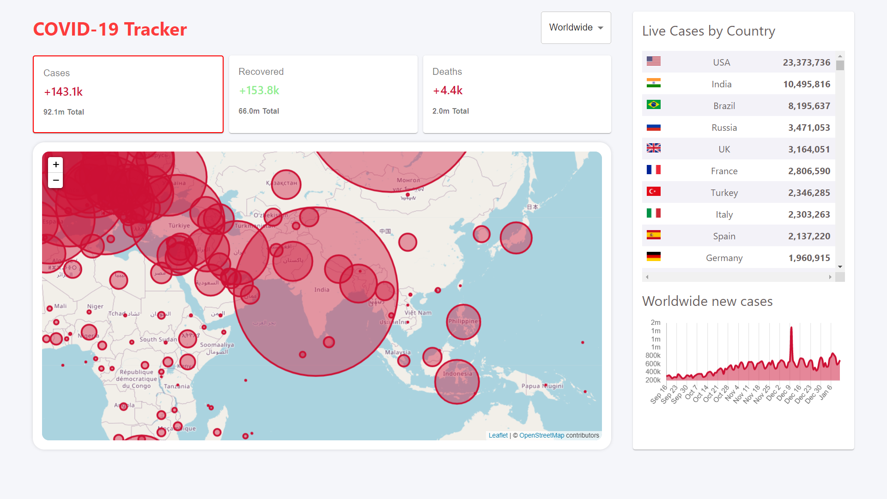

# Covid-19 Tracker

* Aims to provide regular updates about Corona Virus outbreak worldwide.
* It is built in React and it works on desktop as well as mobile browser.

### View Live Demo
<pre><a href="https://covid19-data-logger.netlify.app/"><b>covid19-data-logger.netlify.app</b></a></pre>

### API Utilized for Fetching Covid-19 Data
<pre><a href="https://disease.sh/"><b>disease.sh</b></a></pre>

### Images
<details>
  <summary>Landing Page</summary>
  
</details>

## Features
* Fetches <b>Worldwide Data</b>
* Fetches country-specific data when a <b>Country</b> is <b>selected</b> from the <b>Dropdown Menu</b>
* Represents new Covid 19 cases found worldwide over last 120 days using <b>Chart.js</b>
* Representing country specific data on world map using <b>Open Street Map</b> and <b>React Leaflet</b>

## Setup
#### Clone this repository
```bash
git clone https://github.com/satvikchachra/covid19.git
```

#### Move to desired directory
```bash
cd covid19
```
#### To install the dependencies
```bash
npm install
```
#### To run the app
```bash
npm start
```

## Learn More

You can learn more in the [Create React App documentation](https://facebook.github.io/create-react-app/docs/getting-started).
<br>
To learn React, check out the [React documentation](https://reactjs.org/).


##### Made with ♥ by <a href="https://github.com/satvikchachra">satvikchachra</a>

[](https://github.com/satvikchachra)

